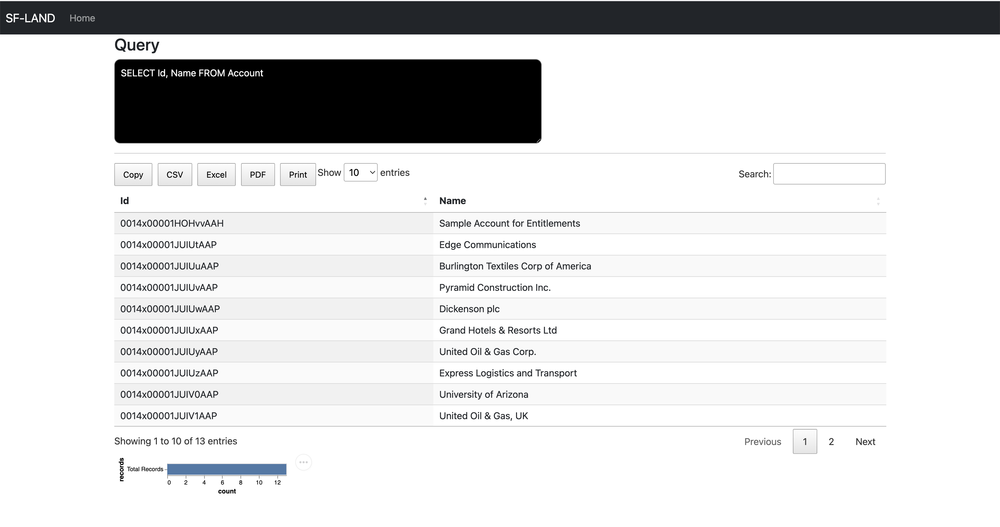
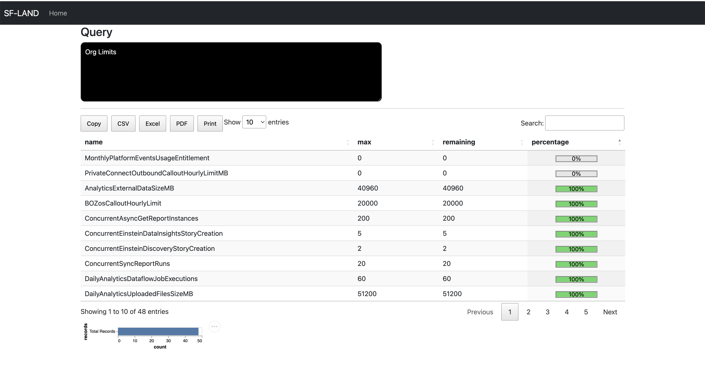

# sf-land 

Welcome to the VS Code Extension - sf-land!

- [Install sf-land ](https://marketplace.visualstudio.com/items?itemName=mohanChinnappan.sf-land)

## Features
### Salesforce specific - Login required
-  [Login into Salesforce and create an Auth JSON file](#login1)
-  [Login with Auth JSON File](#login2)
-  [Runs a given SOQL and provides results output in HTML](#sfquery)

### Code Scan (Salesforce Login not required)
-  [Runs PMD Scan](#pmdscan)

### SF-Land Login into Salesforce to get Auth File
- Login into Salesforce and create an Auth JSON file
    - Uses SFDX for this operation

### SF-LAND Login with Auth JSON File
- Login into the Salesforce Org with the given Auth JSON file

### SF-LAND Run SOQL Query
- Runs a given SOQL and provides results output in HTML

### SF-LAND Run Org Limits
-  Display Limits info in your org

---

### SF-LAND Run PM Scan
- Runs PMD Scan
    - Setup PMD executables as per this [Doc](https://github.com/mohan-chinnappan-n/cli-dx/blob/master/mdapi/pmd-codescan.md)

- Demo
- 

#### Stay tune... More coming

**Enjoy!**
---

- Built by [Mohan Chinnappan](https://www.linkedin.com/in/mohan-chinnappan-232ab632/) with ♥

